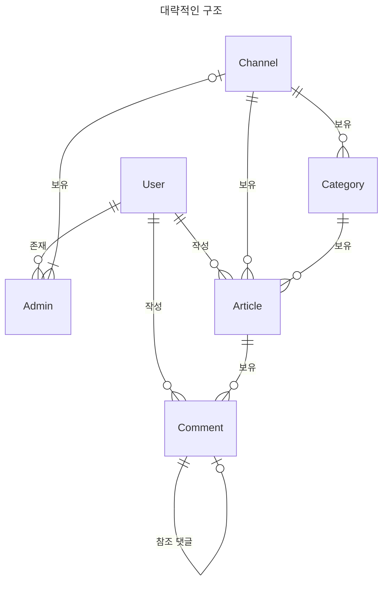
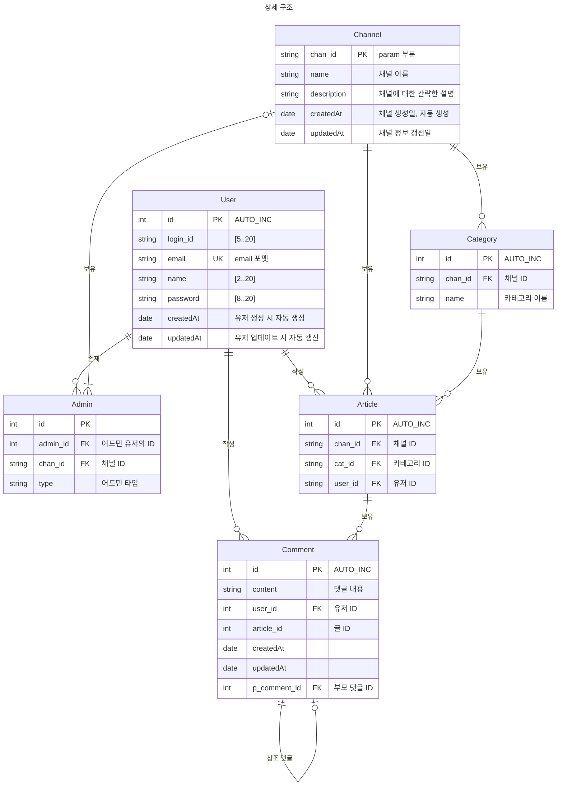

# ER 다이어그램
전체 데이터 구조 설계



```mermaid
---
title: 대략적인 구조
---
erDiagram
  User ||--o{ Admin: "존재"
  User ||--o{ Article: "작성"
  User ||--o{ Comment: "작성"
  Channel |o--|{ Admin: "보유"
  Channel ||--o{ Category: "보유"
  Channel ||--o{ Article: "보유"
  Category ||--o{ Article: "보유"
  Article ||--o{ Comment: "보유"
  Comment ||--o| Comment: "참조 댓글"
```
Category Info는 나중에 처리
```code
  CategoryInfo
  Category ||--o| CategoryInfo: "보유"
```



```mermaid
---
title: 상세 구조
---
erDiagram
  User {
    int id PK "AUTO_INC"
    string login_id "[5..20]"
    string email UK "email 포맷"
    string name "[2..20]"
    string password "[8..20]"
    date createdAt "유저 생성 시 자동 생성"
    date updatedAt "유저 업데이트 시 자동 갱신"
  }

  Channel {
    string chan_id PK "param 부분"
    string name "채널 이름"
    string description "채널에 대한 간략한 설명"
    date createdAt "채널 생성일, 자동 생성"
    date updatedAt "채널 정보 갱신일"
  }

  Admin {
    int id PK
    int admin_id FK "어드민 유저의 ID"
    string chan_id FK "채널 ID"
    string type "어드민 타입"
  }

  Category {
    int id PK "AUTO_INC"
    string chan_id FK "채널 ID"
    string name "카테고리 이름" 
  }

  Article {
    int id PK "AUTO_INC"
    string chan_id FK "채널 ID"
    string cat_id FK "카테고리 ID"
    string user_id FK "유저 ID"
  }

  Comment {
    int id PK "AUTO_INC"
    string content "댓글 내용"
    int user_id FK "유저 ID"
    int article_id "글 ID" 
    date createdAt
    date updatedAt
    int p_comment_id FK "부모 댓글 ID"
  }

  User ||--o{ Admin: "존재"
  User ||--o{ Article: "작성"
  User ||--o{ Comment: "작성"
  Channel |o--|{ Admin: "보유"
  Channel ||--o{ Category: "보유"
  Channel ||--o{ Article: "보유"
  Category ||--o{ Article: "보유"
  Article ||--o{ Comment: "보유"
  Comment ||--o| Comment: "참조 댓글"
```

CategoryInfo